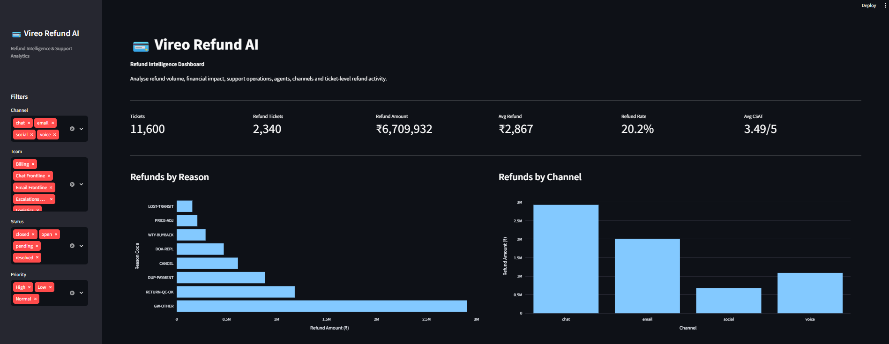
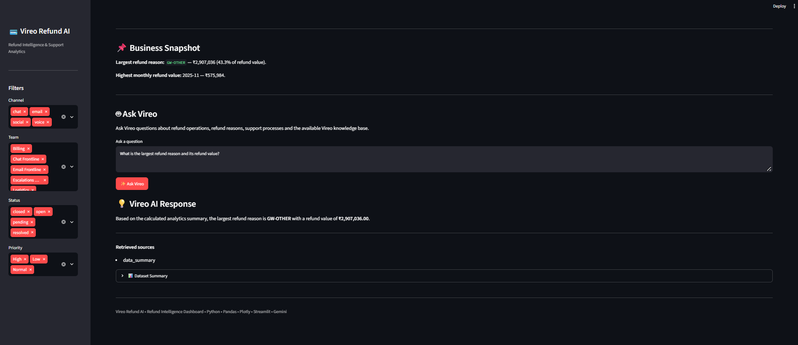
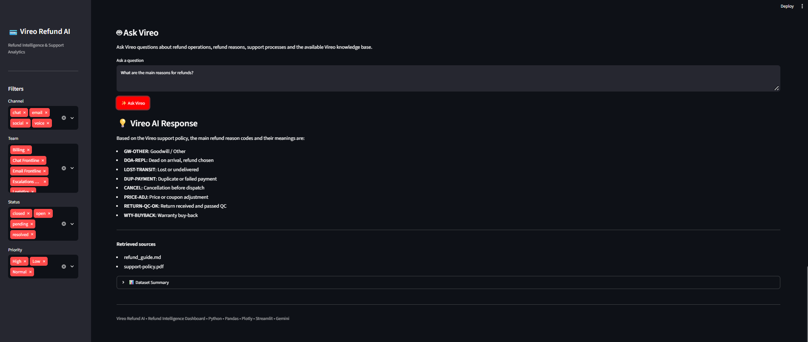
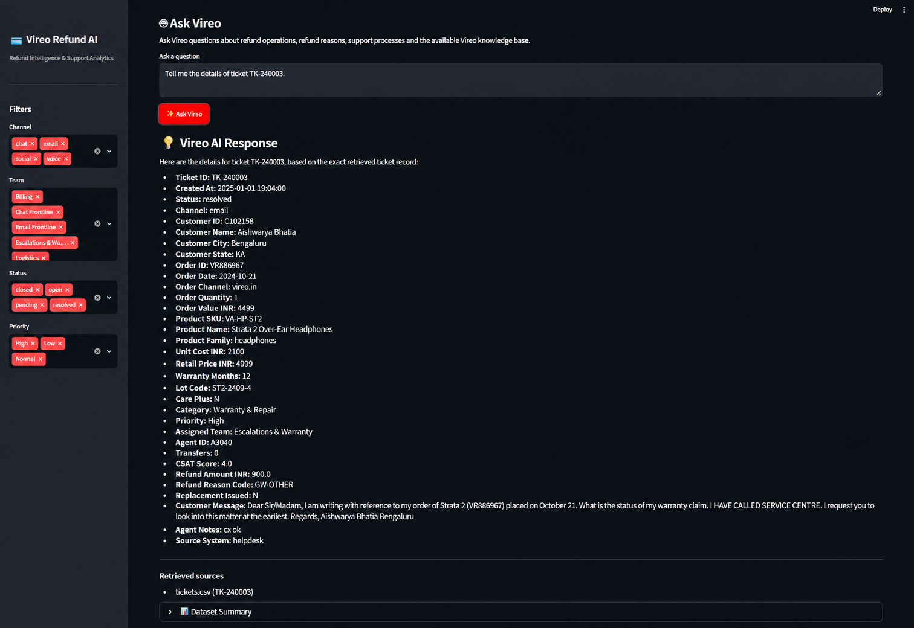
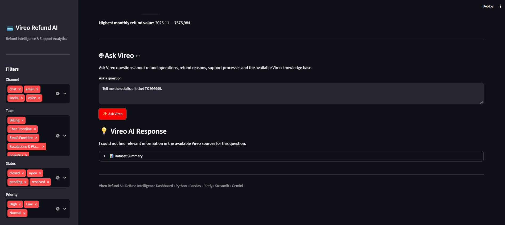

# 💳 Vireo Refund AI

### AI-Powered Refund Intelligence & Support Analytics Dashboard

> **Vireo Refund AI** is a Streamlit-based refund intelligence platform that combines deterministic analytics, source-aware retrieval, and Google Gemini to analyze support tickets, refunds, customer support operations, and ticket-level activity.

<p align="center">

**📊 Analytics** • **🤖 RAG Assistant** • **🎫 Ticket Intelligence** • **🔎 Source Grounding** • **🧪 Tested**

</p>

---

## ✨ Overview

Vireo Refund AI transforms raw support-ticket data into an interactive analytics dashboard with a grounded AI assistant called **Ask Vireo**.

The application is designed to answer questions about:

* 💰 Refunds and refund reasons
* 🎫 Individual support tickets
* 📊 Business and operational analytics
* 📚 Refund and support policies
* 🔄 Data reconciliation
* 👥 Teams, agents and channels
* ⭐ Customer satisfaction

Unlike a generic chatbot, **Ask Vireo uses source-aware retrieval** and deterministic analytical summaries so that responses remain tied to the available Vireo data.

<p align="center">

## 🚀 Live Demo

### 🌐 [Open Vireo Refund AI](https://vireo-refund-ai.streamlit.app)

<a href="https://vireo-refund-ai.streamlit.app"></a>

</p>

---

## 📸 Project Showcase

### 📊 Dashboard Overview

Interactive refund intelligence dashboard with KPIs, filters and refund analytics.



---

### 🤖 Analytics + AI Assistant

Ask Vireo can answer analytical questions using calculated dashboard summaries.



---

### 📚 RAG Knowledge Response

Policy and knowledge-based questions are answered using retrieved project sources.



---

### 🎫 Exact Ticket Retrieval

Ask Vireo can retrieve the exact canonical record for a requested ticket.



---

### 🛡️ Unknown Ticket Handling

Unknown ticket IDs are handled safely without fabricating ticket information.



---

## 🚀 Key Features

### 📊 Refund Intelligence Dashboard

* Total ticket volume
* Refund-ticket volume
* Total refund amount
* Average refund
* Refund rate
* Average CSAT
* Refund analysis by reason
* Refund analysis by channel
* Monthly refund analysis
* Team and agent analysis

### 🎛️ Interactive Filtering

Filter dashboard results using:

* 💬 Channel
* 👥 Team
* 📌 Status
* 🚨 Priority

### 🎫 Ticket Explorer

Search and explore refund-related tickets using:

* Ticket ID
* Customer ID
* Order ID

### 🤖 Ask Vireo AI Assistant

The AI assistant supports multiple question types:

* 📚 Policy questions
* 📈 Analytics questions
* 💳 Refund-reason questions
* 🔄 Reconciliation questions
* 🎫 Exact ticket questions

### 🔎 Source-Aware Retrieval

Retrieved sources are displayed alongside AI responses, making it easier to understand where an answer came from.

### 🛡️ Grounded Responses

The system is designed to avoid unsupported answers.

For example, an unknown ticket such as `TK-999999` returns a source-availability response instead of invented ticket information.

---

# 🧠 Ask Vireo — RAG Architecture

```text
                         ┌─────────────────┐
                         │   User Question │
                         └────────┬────────┘
                                  │
                                  ▼
                         ┌─────────────────┐
                         │ Intent Detection│
                         └────────┬────────┘
                                  │
                                  ▼
                      ┌────────────────────────┐
                      │ Source-Aware Retrieval │
                      └───────────┬────────────┘
                                  │
             ┌────────────────────┼────────────────────┐
             │                    │                    │
             ▼                    ▼                    ▼
      Support Policy        Email Thread        Knowledge Files
      support-policy.pdf    email-thread.txt    knowledge/*.md
             │                    │                    │
             └────────────────────┼────────────────────┘
                                  │
                     ┌────────────┴────────────┐
                     │                         │
                     ▼                         ▼
               Data Summary            Canonical Tickets
                     │                         │
                     └────────────┬────────────┘
                                  │
                                  ▼
                       TF-IDF + Cosine Similarity
                                  │
                                  ▼
                         Retrieved Context
                                  │
                                  ▼
                              Gemini
                                  │
                                  ▼
                     Grounded Answer + Sources
```

### 🎯 Retrieval Strategy

| Question Type     | Primary Source                         |
| ----------------- | -------------------------------------- |
| 📚 Policy         | `support-policy.pdf` + knowledge files |
| 🎫 Exact Ticket   | Canonical ticket record                |
| 🔄 Reconciliation | Analytical summary + email thread      |
| 📈 Analytics      | Deterministic `data_summary`           |
| 💳 Refund Reason  | Analytics + policy reason codes        |

The design keeps **financial calculations deterministic** while using Gemini for natural-language synthesis.

---

# 📈 Verified Dashboard Snapshot

Based on the tested all-filter dashboard view:

| Metric                          |                     Value |
| ------------------------------- | ------------------------: |
| 🎫 Raw ticket rows              |                **12,238** |
| 🧾 Canonical ticket IDs         |                **11,600** |
| 🔁 Duplicate export rows        |                   **638** |
| 💳 Refund tickets               |                 **2,340** |
| 💰 Canonical refund amount      |            **₹6,709,932** |
| 📊 Average refund               |               **~₹2,867** |
| 📈 Refund rate                  |                **~20.2%** |
| ⭐ Average CSAT                  |             **~3.49 / 5** |
| 🔎 Largest refund reason        | **GW-OTHER — ₹2,907,036** |
| 📅 Highest monthly refund value |    **2025-11 — ₹575,984** |

> ℹ️ These values are generated from the canonical reconciliation logic and the tested dashboard configuration.

---

# 🔄 Data Reconciliation

Vireo Refund AI includes a canonical data-processing layer to prevent duplicate or inconsistent records from affecting refund analysis.

### Reconciliation Rules

* One canonical record is maintained per `ticket_id`.
* Current helpdesk records are preferred when the same ticket exists across systems.
* Legacy monetary fields are normalized before analysis.
* Duplicate migration/re-import rows are not counted as separate tickets.
* Analytical calculations are performed on the canonical dataset.

This ensures that refund metrics are based on a consistent dataset before reaching the AI layer.

---

# 🗂️ Data Sources

The project uses the supplied Vireo support data pack:

```text
data/
├── tickets.csv
├── agents.csv
├── customers.csv
├── orders.csv
├── products.csv
├── support-policy.pdf
└── email-thread.txt
```

Additional knowledge used by the RAG layer:

```text
knowledge/
└── refund_guide.md
```

The ticket export covers support activity from **January 2025 through June 2026**, with timestamps supplied by the source data in IST.

---

# 🧪 Testing

The project includes an automated **Pytest** suite covering core retrieval, reconciliation and grounding behavior.

### ✅ Latest Verified Result

```text
10 passed
```

### Tested Scenarios

* ✅ Canonical ticket creation
* ✅ Helpdesk-record preference
* ✅ Policy intent detection
* ✅ Reconciliation intent detection
* ✅ Analytics intent detection
* ✅ Refund-reason intent detection
* ✅ Exact ticket intent detection
* ✅ Exact retrieval of `TK-240003`
* ✅ Unknown ticket handling for `TK-999999`
* ✅ Analytics retrieval restricted to analytical summaries

Run the test suite:

```powershell
python -m pytest -v
```

---

# 🛠️ Technology Stack

| Technology              | Purpose                       |
| ----------------------- | ----------------------------- |
| 🐍 **Python**           | Core application logic        |
| 🐼 **Pandas**           | Data processing & analytics   |
| 📐 **Scikit-learn**     | TF-IDF & similarity retrieval |
| 📄 **PyPDF**            | PDF policy extraction         |
| 📊 **Plotly**           | Interactive visualizations    |
| 🎈 **Streamlit**        | Dashboard & UI                |
| ✨ **Google Gemini API** | AI response generation        |
| 🔐 **python-dotenv**    | Environment configuration     |
| 🧪 **Pytest**           | Automated testing             |

---

# 📁 Project Structure

```text
Vireo-Refund-AI/
│
├── 📂 data/
│   ├── agents.csv
│   ├── customers.csv
│   ├── email-thread.txt
│   ├── orders.csv
│   ├── products.csv
│   ├── support-policy.pdf
│   └── tickets.csv
│
├── 📂 docs/
│   ├── 📂 screenshots/
│   │   ├── dashboard-overview.png
│   │   ├── analytics-ai-response.png
│   │   ├── rag-knowledge-response.png
│   │   ├── ticket-retrieval.png
│   │   └── unknown-ticket-handling.png
│   ├── decisions.md
│   └── memo.md
│
├── 📂 knowledge/
│   └── refund_guide.md
│
├── 📂 outputs/
│
├── 📂 src/
│   ├── analysis.py
│   ├── app.py
│   ├── data_loader.py
│   └── rag_engine.py
│
├── 📂 tests/
│   └── test_refund_analyzer.py
│
├── 🔐 .env.example
├── 🚫 .gitignore
├── 📖 README.md
└── 📦 requirements.txt
```

---

# ⚙️ Local Setup

## 1️⃣ Clone the repository

```powershell
git clone https://github.com/Ashutosh9-pan/Vireo-Refund-AI.git
cd Vireo-Refund-AI
```

## 2️⃣ Create a virtual environment

```powershell
python -m venv .venv
```

Activate it:

```powershell
.venv\Scripts\Activate.ps1
```

## 3️⃣ Install dependencies

```powershell
python -m pip install -r requirements.txt
```

## 4️⃣ Configure Gemini

Create a `.env` file in the project root:

```env
GEMINI_API_KEY=your_gemini_api_key
```

> 🔐 **Security:** Never commit `.env` or expose your Gemini API key publicly.

## 5️⃣ Run the dashboard

```powershell
python -m streamlit run src\app.py
```

Then open:

```text
http://localhost:8501
```

## 6️⃣ Run tests

```powershell
python -m pytest -v
```

## 7️⃣ Optional RAG smoke test

```powershell
python src\rag_engine.py
```

This runs retrieval/Gemini smoke tests and exits when complete.

---

# 💬 Example Ask Vireo Questions

### 📚 Policy

```text
What is the refund policy for a dead-on-arrival product within 7 days?
```

### 🔄 Reconciliation

```text
Why does the refund export require reconciliation?
```

### 📈 Analytics

```text
What is the largest refund reason and its refund value?
```

### 🎫 Existing Ticket

```text
Tell me the details of ticket TK-240003.
```

### 🛡️ Unknown Ticket

```text
Tell me the details of ticket TK-999999.
```

---

# 🛡️ Grounding & Safety

Ask Vireo is designed to minimize unsupported claims.

### The system:

* 🎯 Restricts exact ticket questions to the requested record.
* 📊 Uses deterministic analytical summaries for analytics questions.
* 📚 Grounds policy questions in the written support policy.
* 🔎 Displays retrieved sources with AI responses.
* 🚫 Does not fabricate unknown ticket details.
* 🧩 Avoids using unrelated ticket records for out-of-scope questions.

---

# 🔐 Configuration & Secrets

Runtime configuration uses environment variables.

The following should remain outside version control:

```text
.env
.venv/
.pytest_cache/
__pycache__/
```

Use:

```text
.env.example
```

as the safe configuration template.

---

# 📌 Project Status

### 🟢 Functional & Locally Verified

Current verified capabilities include:

* ✅ Refund analytics dashboard
* ✅ Interactive filters
* ✅ Ticket exploration
* ✅ Data reconciliation
* ✅ Source-aware RAG retrieval
* ✅ Gemini-powered responses
* ✅ Exact ticket retrieval
* ✅ Unknown-ticket handling
* ✅ Automated test suite
* ✅ 10/10 tests passing

---

# 👨‍💻 Author

**Ashutosh Panwar**

💻 Computer Science & Engineering Graduate
🤖 AI/ML Developer • Data Analytics • Software Development

### 🔗 GitHub

**[github.com/Ashutosh9-pan](https://github.com/Ashutosh9-pan)**

### 🌐 Live Application

**[vireo-refund-ai.streamlit.app](https://vireo-refund-ai.streamlit.app)**

### 📁 Repository

**[Ashutosh9-pan/Vireo-Refund-AI](https://github.com/Ashutosh9-pan/Vireo-Refund-AI)**

---

# ⭐ Project Highlights

> **Vireo Refund AI** demonstrates how deterministic data analytics, retrieval-augmented generation, source grounding, and generative AI can be combined into a practical support-intelligence application.

### Built with ❤️ using:

**Python • Pandas • Streamlit • Plotly • Scikit-learn • Google Gemini • Pytest**

---

<p align="center">

### 💳 Vireo Refund AI

**Refund Intelligence • Support Analytics • Grounded AI**

⭐ If you find this project useful, consider giving the repository a star!

</p>
